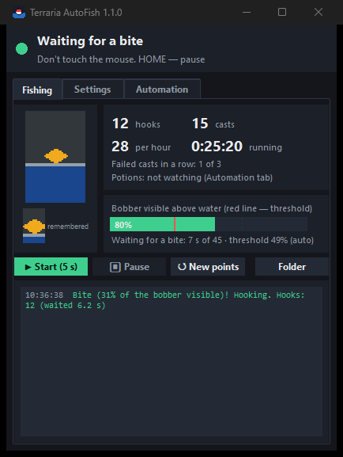
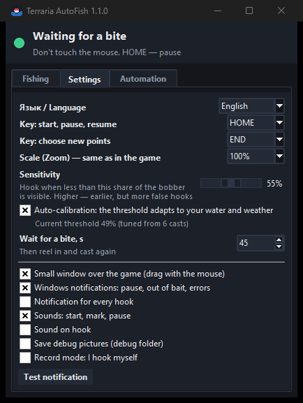
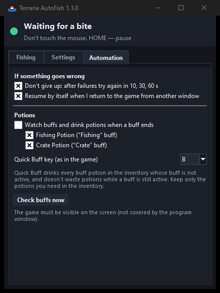
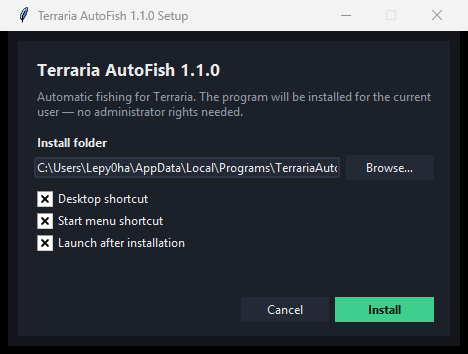
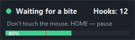

# Terraria AutoFish

**English** | [Русский](README.ru.md)

Automatic fishing for **Terraria** (1.4.4, 1.4.5 and newer, tModLoader). The program watches the
bobber on the screen and hooks the fish the moment the bobber goes under water, then casts again.
It can also keep your Fishing and Crate potion buffs up.

It works **only with screenshots, mouse clicks and key presses**: it does not read or modify game
memory or files, so it does not depend on the game version.

<p>
  
  
  
</p>

## Features

- **Watches the bobber itself** — you mark the bobber once, the program remembers what it looks
  like and hooks when it sinks.
- **Auto-calibration** — the hook threshold adapts to your water, weather, time of day and bobber.
- **Pause and resume without losing points** — even after closing the program. If the bobber is
  still in the water after a pause, the program just keeps watching it.
- **Doesn't give up** — after failures (night, rain, something in the way) it waits and tries again;
  when you return to the game from another window, it resumes by itself.
- **Finds a lost bobber** — if the bobber lands off to the side, the program searches around the
  place you marked and remembers the new spot. Works at night and in caves too.
- **Potions** — watches the Fishing and Crate buffs and drinks potions (with Quick Buff) when a buff
  ends. Tells you when you run out of potions.
- **Ignores distractions** — waves, rain, fish shadows, pets, cursor sparkles, lightning flashes.
- **Clear interface** — what's happening now and what you need to do, a live picture of the
  bobber, stats, an event log, a small window over the game and Windows notifications.
- **Two languages** — English and Russian.

## Download

Get it from [Releases](../../releases):

| File | What it is |
|---|---|
| `TerrariaAutoFish-<version>-setup.exe` | **Installer.** Installs for the current user (no admin rights), adds Desktop and Start menu shortcuts; remove it in Settings → Apps |
| `TerrariaAutoFish-<version>-portable.zip` | **Portable version.** Unpack anywhere (e.g. a USB stick) and run `TerrariaAutoFish.exe`; settings are kept next to the program |

Python is not needed. Or run it from the source code (see [Running from source](#running-from-source)).



## Quick start

1. In Terraria set the display mode to **Windowed** or **Borderless** (in exclusive fullscreen the
   program cannot see the screen).
2. Hold the fishing rod, keep bait in the inventory. The bobber must **not** be cast.
3. Point the cursor at the water (5+ tiles from the character) and press **HOME**.
   Or click **▶ Start (5 s)** in the program window and switch to the game within 5 seconds.
4. The program casts and beeps: point the cursor at the **bobber** and press **HOME** again.
   Being a bit off is fine — the program finds the bobber near the cursor by itself.
5. That's it: the program waits for a bite, hooks and casts again. Don't touch the mouse.

## Controls

| Key (default) | Action |
|---|---|
| **HOME** | Start · mark the bobber · pause · resume with the same points |
| **END** | Forget the cast point and the bobber and choose new ones |

Both keys can be changed in the settings. The points are saved on disk, so after restarting the
program just press **HOME** (if your character hasn't moved).

## Program window

- **Top** — what is happening now and what you need to do.
- **Bobber** — a live picture of what the program is watching, and the remembered bobber.
- **Bobber visible above water** — green bar: everything is calm; when the bar drops below the
  red line, it's a bite and the program hooks.
- **Stats** — hooks, casts, hooks per hour, running time, failed casts in a row, potions.
- **Log** — all events. Green — good, red — pause/problems, yellow — your action is needed.

The small window over the game shows the same things briefly. Drag it with the mouse; clicking it
does not take focus away from the game.



## Settings

| Setting | What it does |
|---|---|
| Language | Auto (as in Windows) / Русский / English |
| Keys | Start/pause/resume key and "new points" key |
| Scale (Zoom) | Set the same value as the Zoom in Terraria's settings |
| Sensitivity | Hook when less than this share of the bobber is visible. Used until auto-calibration has learned (and always if it is off) |
| Auto-calibration | The threshold is tuned automatically (recommended) |
| Wait for a bite | After this time without a bite — reel in and cast again |
| Small window, notifications, sounds | Ways to know what's happening |
| Save debug pictures | Pictures of every search and hook in the `debug` folder — for troubleshooting |
| Record mode | The program casts, you hook yourself; it records how the bobber behaved (`record` folder) |

### Automation tab

| Setting | What it does |
|---|---|
| Don't give up | After 3 failed casts in a row the program doesn't stop but waits 10, 30, then 60 s, goes back to the original mark and tries again. It pauses only if all attempts fail |
| Resume when I return | If fishing paused because you switched to another window, it resumes 2 s after you return to the game |
| Watch buffs and drink potions | Every 20 s the program looks for the Fishing and Crate buff icons (top left). If a buff is gone, it presses **Quick Buff** (B by default) and checks that the buff is back. If not — "out of potions?" notification |
| Quick Buff key | Same as in Terraria's controls |
| Check buffs now | Shows which buffs the program sees right now (the game must be visible) |

Quick Buff drinks every buff potion in the inventory whose buff is not active and never wastes a
potion whose buff is still running — keep only the potions you need in the inventory.

Settings are saved automatically in `%APPDATA%\TerrariaAutoFish` (portable version: in the
`settings` folder next to the program).

## How it works

1. **Marking.** You point at the bobber; the program finds the solid bright blob of the bobber near
   the cursor and remembers its image and colors.
2. **Finding the bobber after each cast.** The program looks for the remembered image near the
   mark and checks that there really is a bobber blob there. The image is updated after every cast,
   so sunset and sunrise don't matter. In the dark, color thresholds are adapted to the brightness.
   If the bobber is not there, the program waits a second and searches three times wider around the
   original mark.
3. **Detecting a bite.** The program counts how many pixels of the bobber's colors are visible
   above the water. When a fish bites, the bobber goes under water and fewer of them are visible.
   Frames with a lightning flash are skipped.
4. **Auto-calibration.** While waiting, the program measures how much the bobber "sinks" on waves
   and in rain. After 2 casts the threshold is set just below that level (median of the last 8
   casts minus 20%, within 35–75%).
5. **Buffs.** Buff icons are drawn semi-transparent over the background, so they are recognized by
   normalized correlation (it doesn't depend on brightness or tint), at any interface scale.

## Troubleshooting

| Problem | Solution |
|---|---|
| Hooks without a bite | Turn auto-calibration on, or lower the sensitivity (e.g. 45%) |
| Misses bites | Raise the sensitivity (e.g. 65%) |
| "Bobber not found" and pause | Usually out of bait. If the bobber lands far away — press **END** and choose new points |
| After restarting, the program doesn't find the bobber | The character moved — press **END** and choose new points |
| Potions are not drunk | Check the Quick Buff key; press "Check buffs now" with the buff active and the game visible |
| Zoom in the game is not 100% | Set the same scale in the settings |
| No Windows notifications | Check "Do not disturb" / Focus assist in Windows |
| The antivirus complains | The .exe is built with PyInstaller and clicks the mouse for you — some antivirus programs react to that. You can run it from the source code instead |

For a detailed analysis turn on **Save debug pictures** — pictures of every search (`poisk`) and
hook (`poklevka`) appear in the `debug` folder next to the program.

## Running from source

Requires Windows 10/11 and Python 3.10+.

```bash
pip install -r requirements.txt
python app.py
```

A console version without a window: `start.bat` (also `start_debug.bat`, `start_record.bat`).
Fine-tuning constants are at the top of `autofish.py`.

`build.bat` builds everything into the `dist` folder: `TerrariaAutoFish.exe`, the installer and the
portable zip.

### Files

| File | Contents |
|---|---|
| `app.py` | The program with a window, overlay and notifications |
| `autofish.py` | Fishing logic: bobber search, bite detection, auto-calibration, recovery, potions; console version |
| `buffs.py`, `pngread.py`, `assets/` | Buff recognition and the buff icons |
| `i18n.py` | Translations (Russian / English) |
| `installer.py`, `setup_core.py` | Installer and uninstaller |
| `build.bat` | Builds the program, the installer and the portable zip |

## Important

Use it in single player or on your own server. Macros are often prohibited on public servers and
you can be banned for them. This project is not affiliated with Re-Logic. The buff icons in
`assets/` are from the [Terraria Wiki](https://terraria.wiki.gg) and belong to Re-Logic.
