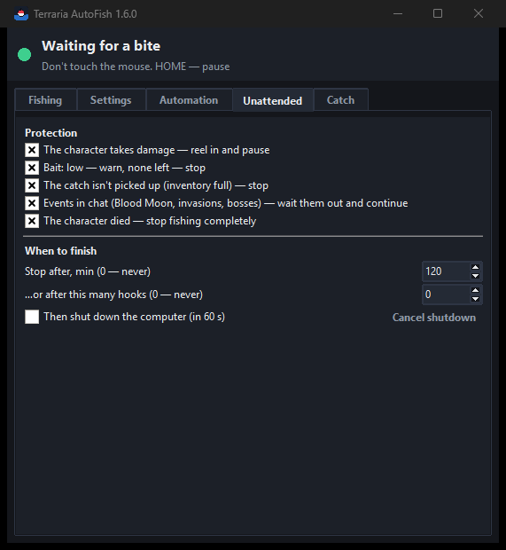
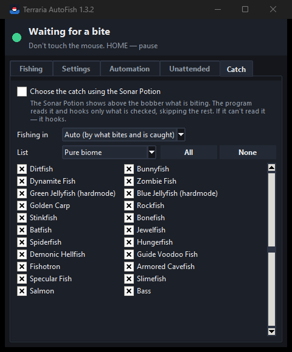

# Terraria AutoFish

**English** | [Русский](README.ru.md)

Automatic fishing for **Terraria** (1.4.4, 1.4.5 and newer, tModLoader). The program watches the
bobber on the screen and hooks the fish the moment the bobber goes under water (or lava), then casts
again. It takes the rod in hand, finds the bobber, drinks potions from the hotbar, can hook only the
catch you want (Sonar Potion), counts what is caught, waits out Blood Moons and invasions and stops
when something goes wrong.

It works **with screenshots, mouse clicks and key presses**: it never reads or changes the game's
memory and never changes its files, so it does not depend on the game version. The only thing it
reads from the game is the item names from the translation tables built into `Terraria.exe` — so
catch names match what the game writes.

<p>
  
  
  
  
  
</p>

## Features

- **Finds the bobber by itself** — after the first cast the program recognizes the bobber on the
  water from the images of all bobbers on the Terraria Wiki (every fishing rod's bobber and all
  Fishing Bobber accessories: regular, glowing, lava/krypton/xenon/argon/neon/helium moss) — in
  water and in lava, where only the top of the bobber sticks out. If it can't, you simply point at
  the bobber once. On the first search it also recognizes the game's **Zoom** by the bobber's size.
- **Takes the fishing rod in hand** — finds the rod in the hotbar by itself (by the bait count
  written on it and by its shape; all 11 rods from the Wiki), remembers the slot of a successful
  cast between launches (or set it yourself) and presses its number key if another item got
  selected (again, if the key press got lost).
- **Watches the bobber** — remembers what it looks like and hooks when it sinks.
- **Auto-calibration** — the hook threshold adapts to your water, weather, time of day and bobber.
- **Pause and resume without losing points** — even after closing the program. If the bobber is
  still in the water after a pause, the program just keeps watching it.
- **Doesn't give up** — after failures (night, rain, something in the way) it waits and tries again;
  when you return to the game from another window, it resumes by itself.
- **Finds a lost bobber** — if the bobber lands off to the side, the program searches around the
  place you marked and remembers the new spot. Works at night and in caves too. If the whole picture
  moved (the character was pushed), the cast point and the mark are moved along.
- **Potions** — watches the Fishing, Crate, Sonar and Calm buffs; when a buff ends, drinks exactly
  that potion from the hotbar (or with Quick Buff). If a potion isn't in the hotbar — one reminder
  for all of them (at most every 10 minutes, can be turned off).
- **Choose what to catch in every biome** — with the Sonar Potion the game writes above the bobber
  what is biting; the program reads it (Windows text recognition) and hooks only what you checked for
  this biome (fish, crates, rare items, junk — 128 catches from the Terraria Wiki, in Russian and
  English), skipping the rest. The moment the text appears is a bite too. Names are taken from the
  installed game, exactly as it writes them.
- **Angler quest** — choose today's quest fish: it is always hooked, and fishing pauses once it's
  caught.
- **Catch report and history** — what was caught this session, today, in 7 days or all time, how
  many and where it lives; save as CSV.
- **Events and death** — "The Blood Moon is rising...", invasions, bosses and other event messages
  in chat: the program reels in, waits the event out and continues by itself (at once when an
  invasion is defeated). If the character dies, fishing stops completely.
- **Unattended fishing** — if the character takes damage, reels in and pauses; warns when bait is
  running low (shows how much bait is left and how long it lasts) and stops as soon as it's gone;
  pauses when the inventory is full; stops after the
  chosen time or number of hooks and can shut the computer down.
- **Ignores distractions** — waves, rain, fish shadows, pets, cursor sparkles, lightning flashes.
- **Clear interface** — what's happening now and what you need to do, a live picture of the
  bobber, stats, an event log, a small window over the game (with the current mode: what is caught,
  biome, potions, what is watched, when to stop, bait, the last catch), Windows notifications, a tray
  icon and a short first-run guide (**F1**). Checks for a new version once a day and updates in one
  click.
- **Two languages** — English and Russian.

## Download

Get it from [Releases](../../releases):

| File | What it is |
|---|---|
| `TerrariaAutoFish-<version>-setup.exe` | **Installer.** Installs for the current user (no admin rights), adds Desktop and Start menu shortcuts; remove it in Settings → Apps |
| `TerrariaAutoFish-<version>-portable.zip` | **Portable version.** Unpack the `TerrariaAutoFish` folder anywhere (e.g. a USB stick) and run `TerrariaAutoFish.exe`; settings are kept next to the program |

The program is a folder: `TerrariaAutoFish.exe` and the `_internal` folder next to it (keep them
together). It's not a single self-extracting exe and isn't packed with UPX — antivirus programs trust
such builds more, and it starts faster. Everything the program writes itself — logs, debug pictures,
records, hotbar snapshots, reports — goes to the `data` folder next to it.

Python is not needed. Or run it from the source code (see [Running from source](#running-from-source)).


## Quick start

1. In Terraria set the display mode to **Windowed** or **Borderless** (in exclusive fullscreen the
   program cannot see the screen).
2. Hold the fishing rod, keep bait in the inventory. The bobber must **not** be cast.
3. Point the cursor at the water (5+ tiles from the character) and press **HOME**.
   Or click **▶ Start (5 s)** in the program window and switch to the game within 5 seconds.
4. The program casts and finds the bobber by itself. If it can't (it beeps and asks), point the
   cursor at the **bobber** and press **HOME** again. Being a bit off is fine.
5. That's it: the program waits for a bite, hooks and casts again. Don't touch the mouse.

## Controls

| Key (default) | Action |
|---|---|
| **HOME** | Start · mark the bobber · pause · resume with the same points |
| **END** | Forget the cast point and the bobber and choose new ones |

Both keys can be changed in the settings. The points are saved on disk, so after restarting the
program just press **HOME** (if your character hasn't moved).

## Program window

- **Top** — what is happening now and what you need to do.
- **Bobber** — a live picture of what the program is watching, and the remembered bobber.
- **Bobber visible above water** — green bar: everything is calm; when the bar drops below the
  red line, it's a bite and the program hooks.
- **Stats** — hooks, casts, hooks per hour, running time, failed casts in a row, potions, the rod's
  hotbar slot and the recognized bobber.
- **Log** — all events. Green — good, red — pause/problems, yellow — your action is needed.

The small window over the game shows the same things briefly, and below the bar — the mode: what is
caught (everything or only checked with the Sonar Potion) and in which biome, the Angler quest,
potions (and which aren't in the hotbar), what is watched (damage, bait, full inventory, events,
death), when to stop, how much bait is left and the last catch. Drag it with the mouse; clicking it
does not take focus away from the game.


## Settings

| Setting | What it does |
|---|---|
| Language | Auto (as in Windows) / Русский / English |
| Keys | Start/pause/resume key and "new points" key |
| Scale (Zoom) | The same value as the Zoom in Terraria's settings. On the first automatic bobber search the program recognizes it by the bobber's size and sets it by itself |
| Sensitivity | Hook when less than this share of the bobber is visible. Used until auto-calibration has learned (and always if it is off) |
| Auto-calibration | The threshold is tuned automatically (recommended) |
| Wait for a bite | After this time without a bite — reel in and cast again |
| Small window, notifications, sounds | Ways to know what's happening |
| Save debug pictures | Pictures of every search and hook in the `data\debug` folder — for troubleshooting |
| Record mode | The program casts, you hook yourself; it records how the bobber behaved (`data\record` folder) |
| Updates | Checks right away whether there is a newer version on GitHub (it also checks by itself once a day; only the public information about the latest release is read). If there is, the button becomes **Update to X**: it downloads the installer of the new version (the size is checked), starts it and closes the program so the installer can replace the files; settings and points are kept. The portable version opens the release page instead |
| Collect a report | Packs the logs, settings, latest debug pictures, hotbar snapshots and system info into `report_….zip` in the `data` folder — send it when something goes wrong. The log is also written to `data\logs` (kept for 14 days) |

### Automation tab

| Setting | What it does |
|---|---|
| Select the fishing rod automatically | Before every cast, if another hotbar slot is selected, the program presses the number key of the rod's slot (only while the game window is active; if the press got lost — once more, waiting a bit longer). If it doesn't work 3 times — it tries again in 2 minutes |
| Fishing rod slot | **Auto:** while the slot is unknown, the program finds the rod in the hotbar by itself; then it remembers the slot from which a cast actually produced a bobber, and keeps it between launches. If after switching to that slot no bobber appears, the slot is forgotten and learned again. Or choose the slot number yourself |
| Hotbar snapshot | In 3 s saves the in-game hotbar pixel for pixel to the `data\hotbar` folder (and how much each slot looks like a fishing rod) — send such snapshots to help tune fishing rod recognition |
| Find the bobber automatically | After the first cast the program looks for the bobber between the character and the cast point using the Terraria Wiki bobber images. If it doesn't find it, it asks you to point at it as before |
| Don't give up | After 3 failed casts in a row the program doesn't stop: it waits 2 s, goes back to the original mark and the original bobber image and tries again — round after round, without stopping. After 10 rounds in a row it sends one notification. It stops right away only if the rod shows no bait |
| Resume when I return | If fishing paused because you switched to another window, it resumes 2 s after you return to the game |
| Watch buffs and drink potions | Every 20 s the program looks for the chosen buff icons (Fishing, Crate, Sonar, Calm; top left). If a buff is gone, it drinks the potion and checks that the buff is back. If not — "out of potions?" notification |
| Drink: from the hotbar | The program finds exactly the needed potion in the hotbar (by the Wiki potion images — also a single potion, on which the game writes no number), selects it with the slot's number key, drinks it with a click and takes the fishing rod again. Only between casts: switching items takes the bobber out of the water. If the potion isn't in the hotbar — a notification |
| Drink: with Quick Buff | Presses **Quick Buff** (B by default, the same key as in Terraria's controls) |
| Remind me when a potion isn't in the hotbar | One line for all missing potions; repeated only when the list changes or every 10 minutes |
| Check buffs now | Shows which buffs the program sees right now (the game must be visible) |

From the hotbar only the needed potion is drunk. Quick Buff drinks every buff potion in the
inventory whose buff is not active and never wastes a potion whose buff is still running — with it
keep only the potions you need in the inventory. "Check buffs now" also shows which hotbar slots
hold the potions.

### Catch tab

| Setting | What it does |
|---|---|
| Choose the catch using the Sonar Potion | When a fish bites, the Sonar Potion shows its name above the bobber. The program reads it and hooks only what is checked; otherwise it lets it go and waits for the next bite. If it can't read the name — it hooks (nothing valuable is lost) |
| Angler quest | Today's quest fish. It is always hooked (even if unchecked in the lists); as soon as it's caught, fishing pauses and you get a notification |
| Catch report | What was caught (by the pickup text) **this session, today, in 7 days or all time**: name, how many, where it lives; hooks, recognized / not recognized, let go by sonar, hooks per hour, days of fishing. **Save CSV** writes it to a file. The history is kept by day in `catch_history.json` next to the settings |
| Fishing in | The biome whose list is used. **Auto** — guessed by what bites (Sonar) and by what is caught: after every hook the program reads the pickup text above the character, so the biome is recognized even without the Sonar Potion (e.g. Neon Tetra means the Jungle). Caught items are also written to the log |
| List | The catches of each biome (from the Terraria Wiki, with "hardmode" marks), plus Crates, Rare items and Junk that can be caught anywhere. "All" / "None" check or clear the whole list |

The name is found by the Windows 10/11 built-in text recognition (Russian and English). It reads
the pixel font of Terraria with mistakes, so every text is read in several ways and matched with all
known catch names; a name counts only if it is clearly better than the next one. Once a name has been
read confidently, the program remembers how it looks and recognizes it next time even if the text
recognition makes mistakes. The names themselves are read from the installed game (`Terraria.exe`
has translation tables inside): Russian names on the Wiki often differ from the game's translation
("Обсидиановая рыба" is "Обсидирыба" in the game), the Wiki name is kept as a spare. With "Choose
the catch" on, the moment the text appears above the bobber also counts as a bite. A bite is let go
only if the name was read confidently — otherwise it is hooked. Without the Sonar buff the program
warns you (every 5 min). With "Save debug pictures" or in record
mode every read is saved to `data\debug` / `data\record` (`…_sonar.png`, and the background `…_sonar_fon.png`) — send them if the
program reads names wrong. Over lava and waves the background changes all the time; colors that are
already nearby in the background snapshot are not taken for letters, so the text is noticed the
moment it appears.

### Unattended tab

| Setting | What it does |
|---|---|
| The character takes damage — reel in and pause | Twice a second the program looks at the health hearts (top right). If there are noticeably fewer of them (8% — about 2 hearts of 20) on two checks in a row, it reels in, pauses and sends a notification. Health regeneration is not a problem: the program compares with the highest level it has seen |
| Watch the bait | The game writes the bait count on the fishing rod. The program reads it by samples of the game's digits (only a confident read counts; otherwise at least the number of digits) and shows the bait and how long it will last at the current pace. Less than 10 — a notification; no number — out of bait: the program stops right away instead of retrying |
| The catch stopped being picked up (inventory full) — stop | If the pickup text doesn't appear for 3 hooks in a row (the catch falls on the ground), fishing pauses and you get a notification. If the old text is still shown (with frequent bites the game only adds to its number), the catch counts as picked up |
| Events in chat — wait them out and continue | The game writes events in chat in green or purple. The program reads such a line and compares it with the game's texts: Blood, Pumpkin and Frost Moon and boss warnings ("You feel an evil presence...") — waits one night (~9 min), solar eclipse — a day (~15 min), goblins, pirates, Frost Legion, martians, celestial invasion and a boss awakening — 10 min; then it continues by itself (or press **HOME**). A message that an invasion is defeated continues fishing at once |
| The character died — stop fishing completely | No red left in the health hearts on two checks in a row (while the hotbar is visible — on the fullscreen map everything is hidden, that's not a death): fishing stops completely and doesn't continue by itself, also while an event is being waited out |
| Stop after, min / …or after this many hooks | 0 — don't stop. Time and hooks are counted as in the stats on the Fishing tab. When the limit is reached, the program reels in and stops |
| Shut down the computer after such a stop | 60 s after the stop; the "Cancel shutdown" button (or `shutdown /a`) cancels it |

Settings are saved automatically in `%APPDATA%\TerrariaAutoFish` (portable version: in the
`settings` folder next to the program).

## How it works

1. **Finding the bobber the first time.** Right before the first cast the program takes a picture
   of the area between the character and the cast point; after the cast it looks only at what has
   appeared (the pier, torches, NPCs and posts stay in place), and compares the new solid bright
   spots with the images of all bobbers from the Terraria Wiki —
   only the above-water part of the bobber, only its opaque pixels, by normalized correlation (so
   brightness and tint don't matter). A match of 75%+ is accepted (a real bobber gives 85–95%,
   empty water about 60%). Otherwise you point at the bobber; the program finds the solid bright
   blob near the cursor. Either way it remembers the bobber's image, colors and type.
2. **Finding the bobber after each cast.** From 0.6 s after the cast the program looks for the
   bobber near the mark several times a second and starts watching as soon as it stays in place on
   two frames in a row — a fish that bites right after the cast is not missed. It looks for the remembered image near the
   mark and checks that there really is a bobber blob there. The image is updated after every cast,
   so sunset and sunrise don't matter. In the dark, color thresholds are adapted to the brightness.
   If the bobber is not there, the program waits a moment and searches three times wider around the
   original mark, and finally looks for the Wiki image of this particular bobber type. When the type is
   known, a found place must look like its Wiki image (75%+) — so the remembered image can't
   "learn" the water edge, which looks the same along the whole surface; after 3 recasts in a row
   without a bite the original image and mark are restored. If it is still
   not found, the program compares the place with its picture from the last successful cast (phase
   correlation, without the character and the bobber): if the whole picture has moved, the cast point
   and the mark are moved by the same amount.
3. **Detecting a bite.** The program counts how many pixels of the bobber's colors are visible
   above the water. When a fish bites, the bobber goes under water and fewer of them are visible.
   Detection works 0.3 s after watching starts. Frames with a lightning flash are skipped. The bar
   shows the lowest value between its updates, so even a short dip of the bobber is visible.
4. **Auto-calibration.** While waiting, the program measures how much the bobber "sinks" on waves
   and in rain (the first 0.6 s after landing, when the bobber still sways, are not counted). The
   threshold is set 15% below that level (a steady level, not the single lowest frame), within
   55–80%: bites often pull the bobber down only to 50–75%. During every cast the threshold is also
   raised on the fly from the calm water of that cast (only raised — small twitches before a bite
   don't lower it). Besides the threshold, a **sharp dip** is a bite too: if the bobber suddenly
   (within 0.25 s) loses a quarter of its visible part and stays down, it is hooked even if the
   threshold was not reached.
5. **Buffs.** Buff icons are drawn semi-transparent over the background, so they are recognized by
   normalized correlation (it doesn't depend on brightness or tint), at any interface scale.
6. **Hotbar.** The selected hotbar slot is the bright yellow one; its position gives the slot number.
   Number keys 1–9, 0 select a slot, just like in the game. By shape alone a rod can't be told from
   a whip, a sword or a pickaxe (hotbar icons are tiny), but the game writes the bait count on a
   fishing rod, and weapons and tools have no numbers. So only slots with a number (rods, stacks
   like potions) are compared with the Wiki rod images, drawn the way the game draws them
   (smoothly scaled, centered, ignoring the digits). The slot of a successful cast is remembered.
   The yellow fill of the selected slot is the longest solid run of yellow rows, so yellow lights
   behind the hotbar don't shift the layout. The bait count is read digit by digit by samples from
   game screenshots (`tools/build_digits.py`).
7. **Health.** Heart pixels (red) are counted in the band of heart rows at the top right; red things
   on the minimap below are not counted. The game removes health from the last heart, so any damage
   reduces the count; no red at all — the character died.
8. **Chat.** Event lines are found by their color (green 50, 255, 130 and purple 175, 75, 255) at
   the bottom left and read by the Windows text recognition; the most similar game text decides
   which event it is (so "A goblin army has arrived" and "…has been defeated" are not mixed up).

## Troubleshooting

| Problem | Solution |
|---|---|
| Hooks without a bite | Turn auto-calibration on, or lower the sensitivity (e.g. 45%) |
| Misses bites | Raise the sensitivity (e.g. 65%) |
| "Bobber not found" and pause | Usually out of bait. If the bobber lands far away — press **END** and choose new points |
| After restarting, the program doesn't find the bobber | The character moved — press **END** and choose new points |
| The program asks to point at the bobber | It didn't recognize the bobber (unusual lighting, another mod's bobber) — just point at it once, then everything is automatic |
| The program switches to a wrong slot | Set the rod slot on the Automation tab, or choose "Auto" and cast once holding the rod — the slot will be remembered again |
| The rod isn't taken | The rod must have bait (the count is written on it) and the hotbar must be visible (inventory closed). Or set the rod slot on the Automation tab. Press "Hotbar snapshot" and send the snapshot |
| Potions are not drunk | Check the Quick Buff key; press "Check buffs now" with the buff active and the game visible |
| Zoom in the game is not 100% | The program recognizes it on the first automatic bobber search; or set the same scale in the settings |
| No Windows notifications | Check "Do not disturb" / Focus assist in Windows |
| Lava: the Sonar text isn't read | Above lava the game makes the picture shimmer (heat distortion) and letters double. Turn off *Settings → Video → Heat Distortion* in the game |
| An event isn't noticed | The chat must be visible (bottom left) and the Windows text recognition available; the game's language — Russian or English |
| The antivirus complains | The program is built with PyInstaller and clicks the mouse for you — some antivirus programs react to that. It is built as a folder, without UPX and with version information to reduce false alarms. The best cure is a code signing certificate (for open-source projects there is a free one from SignPath Foundation — it has to be requested by the project's author). You can also run it from the source code |

For a detailed analysis turn on **Save debug pictures** — pictures of every search (`poisk`) and
hook (`poklevka`) appear in the `data\debug` folder.

## Running from source

Requires Windows 10/11 and Python 3.10+.

```bash
pip install -r requirements.txt
python src/app.py
```

A console version without a window: `scripts\start.bat` (also `start_debug.bat`, `start_record.bat`).
Fine-tuning constants are at the top of `src/autofish.py`. Logs, debug pictures and snapshots are
written to the `data` folder.

`build.bat` builds everything into the `dist` folder: the `TerrariaAutoFish` program folder, the
installer and the portable zip (`build.bat --no-pause` doesn't wait for a key at the end), and puts
the fresh program (`TerrariaAutoFish.exe` and `_internal`) into the project folder (if it isn't running).

On GitHub every change runs all tests (`.github/workflows/build.yml`). Pushing a version tag
(`v1.5.0`) also builds the installer and the portable version on GitHub's servers; the release is
published from your own account with `python tools/publish_release.py v1.5.0` (the description is
taken from `docs/releases/<tag>.md`).

### Tests

`scripts\run_tests.bat` (or `python -m unittest discover -s tests`) runs 104 tests in about four minutes, most of them on
real data from the game in `tests/data`: hotbar snapshots with different selected slots, recorded
bites, bobber search zones and a wide scene with a pier. Full scenarios (start, pause and resume,
taking the rod back, a bite, running out of bait, night, potions, the Sonar Potion, the Angler quest,
a full inventory, a moved picture, chat events and death) run in a "fake game" built from these
snapshots. Other tests use real screenshots from lava, a hotbar with yellow lights behind it and
bait numbers, and check that every message is translated to English.

### Files

| Folder / file | Contents |
|---|---|
| `src/app.py` | The program with a window, overlay and notifications |
| `src/autofish.py` | Fishing engine: settings, control, the main loop; console version |
| `src/vision.py`, `src/fisher_gear.py`, `src/fisher_search.py`, `src/fisher_extras.py`, `src/fisher_catch.py` | Parts of the engine: image analysis and bite detection; rod and bobber marking; bobber search; health, death, events, limits, potions; catch (sonar, pickup text, inventory, Angler quest) |
| `src/sceneshift.py`, `src/chat.py`, `src/history.py` | A moved picture; events in chat; catch history |
| `src/textmemory.py`, `src/updates.py`, `src/tray.py`, `src/wizard.py` | Name memory for catch recognition; updates; tray icon; first-run guide |
| `src/buffs.py`, `src/pngread.py` | Buff recognition |
| `src/catches.py`, `src/sonar.py`, `src/ocr.py`, `src/gamenames.py` | Choosing the catch by the Sonar Potion: catches of every biome, reading the text, Windows text recognition, item names from the installed game |
| `src/sprites.py`, `src/hotbar.py` | Recognition of fishing rods and the bait number in the hotbar and bobbers on the water |
| `src/i18n.py` | Translations (Russian / English) |
| `src/installer.py`, `src/setup_core.py` | Installer and uninstaller |
| `assets/` | Wiki images (buffs, potions, rods, bobbers), catches of every biome, samples of the game's digits |
| `tools/` | `build_catches.py` (catches from the Wiki), `build_digits.py` (digit samples), `publish_release.py` (a release from your account) |
| `scripts/` | Console version, tests, the note for the portable version |
| `tests/` | Tests and real data from the game |
| `docs/` | Screenshots and release descriptions (`docs/releases`) |
| `build.bat`, `.github/workflows/build.yml` | Building; automatic tests and builds on GitHub |
| `TerrariaAutoFish.exe`, `_internal/`, `data/`, `dist/` | Not in the repository: the built program, what it writes (logs, pictures, snapshots), build results |

## Important

Use it in single player or on your own server. Macros are often prohibited on public servers and
you can be banned for them. This project is not affiliated with Re-Logic. The buff, fishing rod and
bobber images in `assets/` are from the [Terraria Wiki](https://terraria.wiki.gg) and belong to
Re-Logic.
