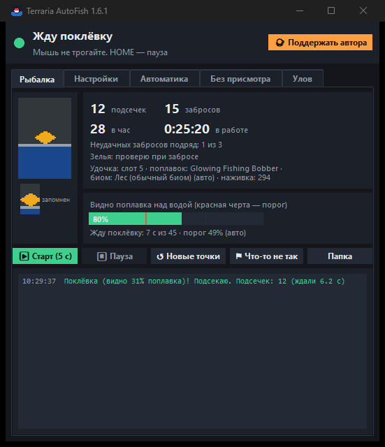
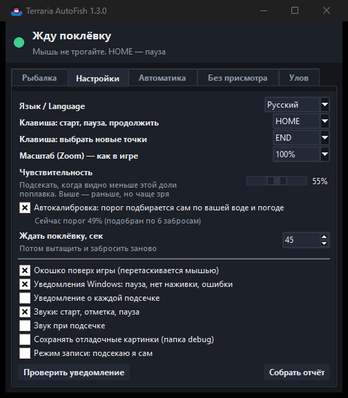
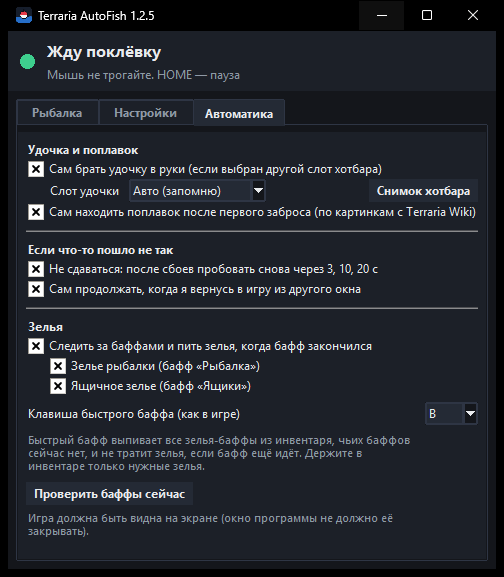
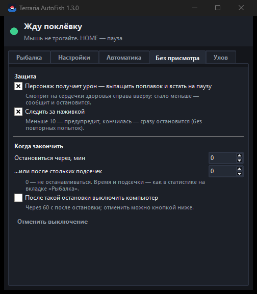
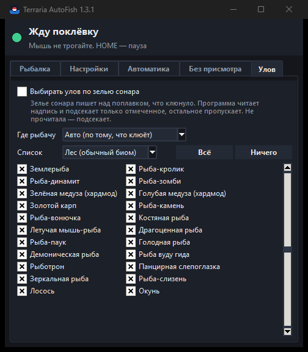
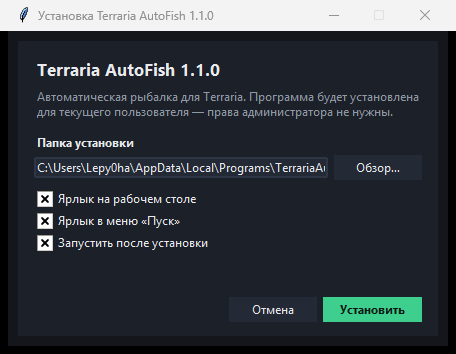
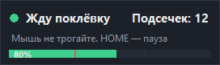

# Terraria AutoFish

[English](README.md) | **Русский**

Автоматическая рыбалка для **Terraria** (1.4.4, 1.4.5 и новее, tModLoader). Программа следит за
поплавком на экране и подсекает рыбу, как только поплавок уходит под воду (или под лаву), а потом
забрасывает снова. Сама берёт удочку, находит поплавок, пьёт зелья из хотбара, может подсекать только
нужный улов (зелье сонара), считает пойманное, пережидает Кровавую луну и вторжения и
останавливается, если что-то пошло не так.

Работает **по снимкам экрана, кликам мыши и нажатиям клавиш**: память игры не читает и не меняет,
файлы игры не меняет, поэтому не зависит от версии игры. Единственное, что программа читает из
игры, — названия предметов из встроенных в `Terraria.exe` таблиц перевода, чтобы названия улова
совпадали с тем, что пишет игра.

<p>
  
  
  
  
  
</p>

## Возможности

- **Сама находит поплавок** — после первого заброса программа узнаёт поплавок на воде по картинкам
  всех поплавков с Terraria Wiki (поплавки каждой удочки и все аксессуары-поплавки: обычный,
  светящийся, лавового/криптонового/ксенонового/аргонового/неонового/гелиевого мха) — в воде и в
  лаве, где из неё торчит только верхушка поплавка. Если не получилось — вы просто один раз
  показываете поплавок курсором. При первом поиске заодно узнаёт **Zoom** игры по размеру поплавка.
- **Сама берёт удочку в руки** — сама находит удочку в хотбаре (по числу наживки на ней и по форме;
  все 11 удочек с Вики), запоминает слот удачного заброса между запусками (или задайте слот сами)
  и жмёт его цифру, если в руках оказался другой предмет (и ещё раз, если нажатие потерялось).
- **Следит за поплавком** — запоминает, как он выглядит, и подсекает, когда он уходит под воду.
- **Автокалибровка** — порог подсечки сам подстраивается под вашу воду, погоду, время суток и поплавок.
- **Пауза и продолжение без потери точек** — даже после закрытия программы. Если после паузы
  поплавок ещё в воде, программа просто продолжает за ним следить.
- **Не сдаётся** — после сбоев (ночь, дождь, что-то мешает) ждёт и пробует снова; когда вы
  возвращаетесь в игру из другого окна — продолжает сама.
- **Находит потерявшийся поплавок** — если поплавок упал в стороне, программа ищет его вокруг
  места, где вы его отметили, и запоминает новое место. Работает и ночью, и в пещерах. Если
  сдвинулась вся картинка (персонажа сдвинуло), точка заброса и отметка переносятся туда же.
- **Зелья** — следит за баффами «Рыбалка», «Ящики», «Сонар» и «Спокойствие»; когда бафф закончился,
  пьёт именно это зелье из хотбара (или быстрым баффом). Зелий нет в хотбаре — одно напоминание
  про все сразу (не чаще раза в 10 минут, можно выключить).
- **Выбор улова в каждом биоме** — с зельем сонара игра пишет над поплавком, что клюнуло; программа
  читает надпись (распознаванием текста Windows) и подсекает только то, что вы отметили для этого
  биома (рыба, ящики, редкое, мусор — 128 видов улова с Terraria Wiki, по-русски и по-английски),
  остальное пропускает. Появление надписи — тоже поклёвка. Названия берутся из установленной игры,
  ровно как она их пишет.
- **Задание рыбака** — выберите сегодняшнюю рыбу: она подсекается всегда, а как только поймана —
  пауза.
- **Отчёт и история улова** — что поймано за эту рыбалку, сегодня, за 7 дней или за всё время,
  сколько и где водится; сохранение в CSV.
- **События и смерть** — «Восходит кровавая луна...», вторжения, боссы и другие события в чате:
  программа вытаскивает поплавок, пережидает событие и продолжает сама (сразу, как только вторжение
  побеждено). Персонаж погиб — рыбалка останавливается совсем.
- **Рыбалка без присмотра** — персонаж получает урон — вытащит поплавок и встанет на паузу;
  покажет, сколько наживки осталось и на сколько её хватит, предупредит, что её мало, и
  остановится, как только она кончится; встанет на паузу, если
  инвентарь полон; остановится через заданное время или число подсечек и может выключить компьютер.
- **Не отвлекается** на волны, дождь, тени рыб, питомцев, искры у курсора, вспышки молний.
- **Понятный интерфейс** — что происходит сейчас и что нужно сделать вам, живая картинка
  поплавка, статистика, журнал, окошко поверх игры (с режимом работы: что ловим, биом, зелья, за
  чем слежу, когда стоп, наживка, последний улов), уведомления Windows, значок в трее и короткий
  мастер первого запуска (**F1**). Раз в сутки проверяет, не вышла ли новая версия, и обновляется
  в один клик (и установленная, и портативная). **«Диагностика»** проверяет всё сразу, а
  **«Что-то не так»** сохраняет последние картинки и журнал для разбора. Работает и на втором мониторе;
  пока ждёт поклёвку, делает 60 снимков в секунду — столько, сколько рисует игра.
- **Два языка** — русский и английский.

## Скачать

В разделе [Releases](../../releases):

| Файл | Что это |
|---|---|
| `TerrariaAutoFish-<версия>-setup.exe` | **Установщик.** Ставит программу для текущего пользователя (права администратора не нужны), создаёт ярлыки на рабочем столе и в меню «Пуск»; удалить — в «Параметры → Приложения» |
| `TerrariaAutoFish-<версия>-portable.zip` | **Портативная версия.** Распакуйте папку `TerrariaAutoFish` куда угодно (хоть на флешку) и запустите `TerrariaAutoFish.exe`; настройки хранятся рядом с программой |

Программа — это папка: `TerrariaAutoFish.exe` и рядом папка `_internal` (держите их вместе). Это не
один самораспаковывающийся exe и не сжатый UPX — таким сборкам антивирусы доверяют больше, и
запускается программа быстрее. Всё, что программа пишет сама, — журналы, отладочные картинки,
записи, снимки хотбара, отчёты — лежит в папке `data` рядом с ней.

Python не нужен. Или запускайте из исходников (см. [Запуск из исходников](#запуск-из-исходников)).



## Быстрый старт

1. В Terraria включите режим экрана **«Оконный»** или **«Без рамки»** (в полноэкранном режиме
   программа не видит экран).
2. Возьмите удочку, наживка — в инвентаре. Поплавок **не** должен быть заброшен.
3. Наведите курсор на воду (в 5+ блоках от персонажа) и нажмите **HOME**.
   Или нажмите **▶ Старт (5 с)** в окне программы и за 5 секунд переключитесь в игру.
4. Программа забросит и сама найдёт поплавок. Если не нашла (пискнет и попросит) — наведите
   курсор на **поплавок** и снова нажмите **HOME**. Можно чуть мимо.
5. Всё: программа ждёт поклёвку, подсекает и забрасывает снова. Мышь не трогайте.

## Управление

| Клавиша (по умолчанию) | Действие |
|---|---|
| **HOME** | Старт · отметить поплавок · пауза · продолжить с теми же точками |
| **END** | Забыть точку заброса и поплавок и выбрать новые |

Обе клавиши меняются в настройках. Точки сохраняются на диск, поэтому после перезапуска
программы просто нажмите **HOME** (если персонаж не сдвинулся).

## Окно программы

- **Вверху** — что происходит сейчас и что нужно сделать вам.
- **Поплавок** — живая картинка того, за чем следит программа, и запомненный поплавок.
- **Видно поплавка над водой** — зелёная полоса: всё спокойно; когда полоса падает за красную
  черту — это поклёвка, программа подсекает.
- **Статистика** — подсечки, забросы, подсечек в час, время работы, неудачи подряд, зелья, слот
  удочки и узнанный поплавок, наживка, нагрузка программы на процессор.
- **⚑ Что-то не так** — если программа сделала что-то странное, нажмите: последние 60 картинок поиска,
  поклёвок и надписей (они хранятся в памяти даже без отладочных картинок), снимок окна игры, конец
  журнала и настройки сохранятся в `data\reports\mistake_….zip` — пришлите его.
- **Журнал** — все события. Зелёные — хорошо, красные — пауза/проблемы, жёлтые — нужно ваше действие.

Окошко поверх игры показывает то же самое коротко, а под шкалой — режим работы: что ловим (всё или
только отмеченное по сонару) и в каком биоме, задание рыбака, зелья (и каких нет в хотбаре), за чем
слежу (урон, наживка, полный инвентарь, события, смерть), когда остановиться, сколько наживки и
последний улов. Его можно перетащить мышью; клик по нему не забирает фокус у игры. В настройках
можно поменять непрозрачность и размер текста, выключить блок режима и прятать окошко на паузе.



## Настройки

| Настройка | Что делает |
|---|---|
| Язык | Авто (как в Windows) / Русский / English |
| Клавиши | Клавиша старта/паузы/продолжения и клавиша «новые точки» |
| Масштаб (Zoom) | Такой же, как Zoom в настройках Terraria. При первом автопоиске поплавка программа узнаёт его по размеру поплавка и ставит сама |
| Чувствительность | Подсекать, когда видно меньше этой доли поплавка. Используется, пока автокалибровка не обучилась (и всегда, если она выключена) |
| Автокалибровка | Порог подбирается сам (рекомендуется) |
| Ждать поклёвку | Столько секунд без поклёвки — вытащить и забросить заново |
| Окошко, уведомления, звуки | Способы узнать, что происходит; для окошка — непрозрачность, размер текста, режим работы, прятать на паузе |
| Сохранять отладочные картинки | Картинки каждого поиска и подсечки в папке `data\debug` — для разбора проблем |
| Режим записи | Программа забрасывает, подсекаете вы сами; она записывает, как вёл себя поплавок (папка `data\record`) |
| Обновления | Сразу проверяет, нет ли на GitHub версии новее (сама программа проверяет раз в сутки; читаются только публичные сведения о последнем релизе). Если есть — кнопка становится **«Обновить до X»**: скачивает установщик новой версии (размер сверяется), запускает его и закрывает программу, чтобы он мог заменить файлы; настройки и точки сохраняются. Портативная версия скачивает свой архив, закрывается, заменяет свои файлы (`settings` и `data` не трогаются) и запускается снова |
| Диагностика | Через 3 с (переключитесь в игру) проверяет всё, что нужно для рыбалки: окно игры, хотбар и масштаб интерфейса, удочку и наживку, зелья в хотбаре и баффы, сердечки здоровья, языки распознавания текста Windows, названия из игры, Zoom и сохранённые точки — на каждый пункт подсказка, что сделать. Итог — в окне и в `data\diagnostics_….txt` (и в отчёте) |
| Собрать отчёт | Складывает журналы, настройки, последние отладочные картинки, снимки хотбара и сведения о системе в `report_….zip` в папке `data` — пришлите его, если что-то не так. Журнал ещё и пишется в `data\logs` (хранится 14 дней) |

### Вкладка «Автоматика»

| Настройка | Что делает |
|---|---|
| Сам брать удочку в руки | Перед каждым забросом, если выбран другой слот хотбара, программа жмёт цифру слота удочки (только когда окно игры активно; нажатие потерялось — ещё раз, подождав подольше). Не вышло 3 раза — снова пробует через 2 минуты |
| Слот удочки | **Авто:** пока слот неизвестен, программа сама находит удочку в хотбаре; потом запоминает слот, с которого заброс действительно дал поплавок, и помнит его между запусками. Если после переключения на этот слот поплавка нет — слот забывается и запоминается заново. Или выберите номер слота сами |
| Снимок хотбара | Через 3 с сохраняет хотбар из игры пиксель в пиксель в папку `data\hotbar` (и насколько каждый слот похож на удочку) — по таким снимкам настраивается распознавание удочек |
| Сам находить поплавок | После первого заброса программа ищет поплавок между персонажем и точкой заброса по картинкам поплавков с Terraria Wiki. Не нашла — попросит показать его, как раньше |
| Не сдаваться | После 3 неудачных забросов подряд программа не останавливается: ждёт 2 с, возвращается к исходной отметке и исходному образцу поплавка и пробует снова — круг за кругом, без остановки. После 10 кругов подряд присылает одно уведомление. Сразу останавливается, только если на удочке нет наживки |
| Сам продолжать, когда вернусь | Если рыбалка встала на паузу из-за того, что вы переключились в другое окно, она продолжится через 2 с после возврата в игру |
| Следить за баффами и пить зелья | Раз в 20 с программа ищет иконки выбранных баффов («Рыбалка», «Ящики», «Сонар», «Спокойствие»; слева вверху). Если баффа нет — пьёт зелье и проверяет, что бафф появился. Если нет — уведомление «кончились зелья?» |
| Пить: из хотбара | Программа находит в хотбаре именно нужное зелье (по картинкам зелий с Вики — и одно зелье, на котором игра не пишет число), берёт его цифрой слота, пьёт кликом и снова берёт удочку. Только между забросами: смена предмета убирает поплавок из воды. Зелья нет в хотбаре — уведомление |
| Пить: быстрым баффом | Нажимает **быстрый бафф** (по умолчанию B — та же клавиша, что в управлении Terraria) |
| Напоминать, если зелья нет в хотбаре | Одна строка про все недостающие зелья; повтор — только если список изменился или раз в 10 минут |
| Проверить баффы сейчас | Показывает, какие баффы программа видит прямо сейчас (игра должна быть видна) |

Из хотбара выпивается только нужное зелье. Быстрый бафф выпивает все зелья-баффы из инвентаря, чьих
баффов сейчас нет, и никогда не тратит зелье, если его бафф ещё идёт — с ним держите в инвентаре
только нужные зелья. «Проверить баффы сейчас» ещё и показывает, в каких слотах хотбара лежат зелья.

### Вкладка «Улов»

| Настройка | Что делает |
|---|---|
| Выбирать улов по зелью сонара | Когда клюёт, зелье сонара пишет над поплавком название. Программа читает его и подсекает только отмеченное; иначе отпускает и ждёт следующую поклёвку. Не прочитала название — подсекает (ценное не потеряется) |
| Задание рыбака | Сегодняшняя рыба для рыбака. Она подсекается всегда (даже если не отмечена в списках); как только поймана — пауза и уведомление |
| Отчёт об улове | Что поймано (по надписям о подборе) **за эту рыбалку, сегодня, за 7 дней или за всё время**: название, сколько, где водится; подсечки, узнано / не узнано, отпущено сонаром, подсечек в час, дней с рыбалкой; ящики, редкое и биом, давший больше всего; графики улова за 14 дней и по часам суток. **Сохранить CSV** — в файл. История хранится по дням и часам в `catch_history.json` рядом с настройками |
| Где рыбачу | Чей список использовать. **Авто** — по тому, что клюёт (сонар), и по тому, что поймано: после каждой подсечки программа читает надпись о подборе над персонажем, поэтому биом узнаётся и без зелья сонара (например, «Голубой неон» — значит, джунгли). Пойманное ещё и пишется в журнал |
| Список | Улов каждого биома (с Terraria Wiki, с пометкой «хардмод»), а ещё ящики, редкое и мусор, которые ловятся везде. «Всё» / «Ничего» — отметить или снять весь список |

Название читает встроенное в Windows 10/11 распознавание текста (русский и английский). Пиксельный
шрифт Terraria оно читает с ошибками, поэтому каждая надпись читается несколькими способами и
сверяется со всеми известными названиями улова; название засчитывается, только если оно заметно
лучше следующего. Уверенно прочитанное название программа запоминает «в лицо» и в следующий раз
узнаёт его, даже если распознавание ошибается. Сами названия берутся из установленной игры (внутри
`Terraria.exe` есть таблицы перевода): русские названия на Вики часто не совпадают с переводом в
игре («Обсидиановая рыба» — в игре «Обсидирыба»), название с Вики остаётся запасным. С включённым
выбором улова появление надписи над поплавком тоже считается поклёвкой.
Отпускается поклёвка, только если название прочитано уверенно, — иначе подсечка.
Без баффа сонара программа предупреждает (раз в 5 минут). С «Сохранять отладочные картинки»
или в режиме записи каждое чтение сохраняется в `data\debug` / `data\record` (`…_sonar.png` и фон
`…_sonar_fon.png`) — пришлите их, если программа читает названия неправильно. Над лавой и волнами фон
всё время меняется; цвета, которые уже есть рядом на снимке фона, не принимаются за буквы, поэтому
надпись замечается в тот же момент, как появилась.

### Вкладка «Без присмотра»

| Настройка | Что делает |
|---|---|
| Персонаж получает урон — вытащить поплавок и встать на паузу | Два раза в секунду программа смотрит на сердечки здоровья (справа вверху). Если их заметно меньше (на 8 % — примерно 2 сердечка из 20) две проверки подряд — вытаскивает поплавок, встаёт на паузу и присылает уведомление. Восстановление здоровья не мешает: сравнение идёт с самым высоким уровнем, который программа видела |
| Следить за наживкой | На удочке игра пишет количество наживки. Программа читает его по образцам цифр игрового шрифта (засчитывается только уверенное прочтение, иначе — хотя бы сколько в числе цифр) и показывает, сколько наживки и на сколько её хватит при нынешнем темпе. Меньше 10 — уведомление; числа нет — наживка кончилась: программа сразу останавливается, а не пробует снова |
| Улов перестал подбираться (инвентарь полон) — остановиться | Если надписи о подборе нет 3 подсечки подряд (улов падает на землю) — пауза и уведомление. Если ещё видна старая надпись (при частых поклёвках игра только прибавляет к ней число), улов считается подобранным |
| События в чате — переждать и продолжить | Игра пишет события в чат зелёным или фиолетовым. Программа читает такую строку и сверяет с текстами игры: Кровавая, Тыквенная и Морозная луны и предупреждения о боссах («Вы чувствуете чье-то злобное внимание...») — пережидает ночь (~9 мин), солнечное затмение — день (~15 мин), гоблины, пираты, Ледяной легион, марсиане, небесное вторжение и пробуждение босса — 10 мин; потом продолжает сама (или нажмите **HOME**). Сообщение, что вторжение побеждено, — продолжает сразу |
| Персонаж погиб — остановить рыбалку совсем | Красного в сердечках не осталось две проверки подряд (а хотбар при этом виден — на полноэкранной карте скрыто всё, это не смерть): рыбалка останавливается совсем и сама не продолжается, в том числе пока пережидается событие |
| Остановиться через, мин / …или после стольких подсечек | 0 — не останавливаться. Время и подсечки считаются как в статистике на вкладке «Рыбалка». Когда лимит достигнут, программа вытаскивает поплавок и останавливается |
| После такой остановки выключить компьютер | Через 60 с после остановки; отменить — кнопка «Отменить выключение» (или команда `shutdown /a`) |

Настройки сохраняются сами в `%APPDATA%\TerrariaAutoFish` (портативная версия — в папке
`settings` рядом с программой).

## Как это работает

1. **Первый поиск поплавка.** Прямо перед первым забросом программа снимает место между
   персонажем и точкой заброса, а после заброса смотрит только на то, что появилось (пирс,
   факелы, NPC и столбы стоят на месте), и сравнивает новые сплошные яркие пятна с картинками
   всех поплавков с Terraria Wiki — только надводную часть
   поплавка, только его непрозрачные пиксели, нормированной корреляцией (яркость и оттенок не
   важны). Совпадение от 75 % засчитывается (настоящий поплавок даёт 85–95 %, пустая вода — около
   60 %). Иначе поплавок показываете вы; программа находит рядом с курсором сплошное яркое пятно.
   В любом случае она запоминает вид, цвета и тип поплавка.
2. **Поиск поплавка после каждого заброса.** Через 0.6 с после заброса программа несколько раз в
   секунду ищет поплавок у отметки и начинает следить, как только он два снимка подряд на одном
   месте, — рыба, клюнувшая сразу после заброса, не пропускается. Программа ищет запомненный вид рядом с отметкой и
   проверяет, что там действительно пятно поплавка. Образец обновляется после каждого заброса,
   поэтому закат и рассвет не мешают. В темноте пороги цвета подстраиваются под яркость картинки.
   Если поплавка на месте нет, программа ждёт мгновение и ищет втрое шире вокруг исходной отметки,
   а напоследок — по картинке с Вики именно этого вида поплавка. Когда вид известен, найденное место
   должно быть похоже на его картинку с Вики (от 75 %) — так образец не «переучится» на кромку воды,
   одинаковую по всей поверхности; после 3 перезабросов подряд без поклёвки возвращаются исходные
   образец и отметка. Не нашла и так — сравнивает место со
   снимком после последнего удачного заброса (фазовая корреляция, без персонажа и поплавка): если
   сдвинулась вся картинка, точка заброса и отметка переносятся на столько же.
3. **Поклёвка.** Программа считает, сколько пикселей цвета поплавка видно над водой. Когда рыба
   клюёт, поплавок уходит под воду и их становится меньше. Поклёвка ловится уже через 0.3 с после
   начала слежения. Кадры со вспышкой молнии пропускаются. Полоска показывает самое малое значение
   между обновлениями, поэтому даже короткий нырок поплавка на ней виден.
4. **Автокалибровка.** Пока программа ждёт, она замеряет, насколько поплавок «проседает» на волнах
   и в дождь (первые 0.6 с после приводнения, пока поплавок ещё покачивается, не учитываются).
   Порог ставится на 15 % ниже этого уровня (устойчивого, а не самого низкого кадра), в пределах
   55–80 %: поклёвки часто уводят поплавок только до 50–75 %. Во время каждого заброса порог ещё и
   поднимается на лету по спокойной воде этого заброса (только вверх — лёгкие подёргивания перед
   поклёвкой его не опускают). Кроме порога поклёвкой считается и **резкий нырок**: если поплавок
   вдруг (за 0.25 с) потерял четверть видимой части и остался внизу — подсечка, даже если до
   порога он не дошёл.
5. **Баффы.** Иконки баффов рисуются полупрозрачными поверх фона, поэтому программа узнаёт их
   нормированной корреляцией — она не зависит от яркости и оттенка — при любом масштабе интерфейса.
6. **Хотбар.** Выбранный слот хотбара — ярко-жёлтый, по его месту программа узнаёт номер слота.
   Слот выбирается цифрами 1–9, 0 — как в игре. По одной форме удочку не отличить от кнута, меча
   или кирки (иконки в хотбаре крошечные), но на удочке игра пишет количество наживки, а на оружии
   и инструментах чисел нет. Поэтому с картинками удочек с Вики сравниваются только слоты с числом
   (удочки и стопки вроде зелий), нарисованными так, как рисует игра (сглаженно уменьшенными, по
   центру, без цифр). Слот удачного заброса запоминается. Жёлтая заливка выбранного слота — самый
   длинный сплошной отрезок жёлтых строк, поэтому жёлтые огоньки за хотбаром раскладку не сбивают.
   Число наживки читается по цифрам — по образцам со снимков из игры (`tools/build_digits.py`).
7. **Здоровье.** Считаются пиксели сердечек (красные) в полосе рядов сердечек справа вверху;
   красное на мини-карте ниже не учитывается. Игра убирает здоровье с последнего сердечка,
   поэтому любой урон уменьшает этот счёт; красного нет совсем — персонаж погиб.
8. **Чат.** Строки событий находятся по цвету (зелёный 50, 255, 130 и фиолетовый 175, 75, 255) слева
   внизу и читаются распознаванием текста Windows; какое это событие, решает самый похожий текст
   игры (поэтому «Армия гоблинов прибыла» и «…побеждена» не путаются).

## Если что-то не так

Начните с **«Диагностики»** (вкладка «Настройки») — она покажет, что не так и что сделать. Если
программа сделала что-то странное, нажмите **«⚑ Что-то не так»** на вкладке «Рыбалка» и пришлите
сохранённый архив.

| Проблема | Решение |
|---|---|
| Подсекает без поклёвки | Включите автокалибровку или уменьшите чувствительность (например, 45 %) |
| Пропускает поклёвки | Увеличьте чувствительность (например, 65 %) |
| «Поплавок не найден» и пауза | Обычно кончилась наживка. Если поплавок падает далеко — нажмите **END** и выберите точки заново |
| После перезапуска не находит поплавок | Персонаж сдвинулся — нажмите **END** и выберите точки заново |
| Просит показать поплавок | Не узнала поплавок (необычное освещение, поплавок из мода) — покажите его один раз, дальше всё само |
| Переключает не на тот слот | Задайте слот удочки на вкладке «Автоматика» или выберите «Авто» и один раз забросьте с удочкой в руках — слот запомнится заново |
| Не берёт удочку | На удочке должна быть наживка (на ней написано её количество), хотбар должен быть виден (инвентарь закрыт). Или задайте слот удочки на вкладке «Автоматика». Нажмите «Снимок хотбара» и пришлите снимок |
| Не пьёт зелья | Проверьте клавишу быстрого баффа; нажмите «Проверить баффы сейчас», когда бафф есть и игра видна |
| Zoom в игре не 100 % | Программа узнаёт его при первом автопоиске поплавка; или выставьте такой же масштаб в настройках |
| Нет уведомлений Windows | Проверьте «Не беспокоить» / «Помощник фокусировки» в Windows |
| Лава: не читается надпись сонара | Над лавой игра «дрожит» картинку (искажение от тепла), и буквы двоятся. Выключите в игре *Настройки → Видео → «Искажение от тепла»* |
| Не замечает событие | Чат должен быть виден (слева внизу), распознавание текста Windows — доступно; язык игры — русский или английский |
| Антивирус ругается | Программа собрана PyInstaller и нажимает мышь за вас — некоторые антивирусы на такое реагируют. Чтобы ложных тревог было меньше, она собрана папкой, без UPX и со сведениями о версии. Лучшее средство — подпись программы сертификатом (для открытых проектов есть бесплатная от SignPath Foundation — её запрашивает автор проекта). Можно и запускать из исходников |

Для подробного разбора включите **«Сохранять отладочные картинки»** — в папке `data\debug`
появятся картинки каждого поиска (`poisk`) и подсечки (`poklevka`).

## Запуск из исходников

Нужны Windows 10/11 и Python 3.10+.

```bash
pip install -r requirements.txt
python src/app.py
```

Консольная версия без окна: `scripts\start.bat` (а также `start_debug.bat`, `start_record.bat`).
Тонкие настройки — в начале `src/autofish.py`. Журналы, отладочные картинки и снимки пишутся в папку
`data`.

`build.bat` собирает всё в папку `dist`: папку программы `TerrariaAutoFish`, установщик и
портативный архив (`build.bat --no-pause` не ждёт нажатия клавиши в конце), и кладёт свежую
программу (`TerrariaAutoFish.exe` и `_internal`) в папку проекта (если она не запущена).

На GitHub на каждое изменение запускаются все тесты (`.github/workflows/build.yml`). По метке версии
(`v1.5.0`) установщик и портативная версия ещё и собираются на серверах GitHub; релиз выкладывается
от своего аккаунта командой `python tools/publish_release.py v1.5.0` (описание берётся из
`docs/releases/<метка>.md`).

### Тесты

`scripts\run_tests.bat` (или `python -m unittest discover -s tests`) примерно за четыре с половиной минуты
прогоняет 118 тестов, большинство — на настоящих данных из игры в `tests/data`: снимки хотбара с разными выбранными слотами,
записанные поклёвки, зоны поиска поплавка и широкий кадр с пирсом. Сценарии целиком (старт, пауза
и продолжение, возврат удочки в руки, поклёвка, кончилась наживка, ночь, зелья, зелье сонара,
задание рыбака, полный инвентарь, сдвиг картинки, события в чате и смерть) идут в «поддельной
игре», собранной из этих снимков. Другие тесты — на настоящих снимках из лавы, хотбаре с жёлтыми
огоньками за ним и числах наживки, а ещё проверка, что все сообщения переведены на английский.

### Файлы

| Папка / файл | Что внутри |
|---|---|
| `src/app.py` | Программа с окном, окошком поверх игры и уведомлениями |
| `src/autofish.py` | Движок рыбалки: настройки, управление, основной цикл; консольная версия |
| `src/vision.py`, `src/fisher_gear.py`, `src/fisher_search.py`, `src/fisher_extras.py`, `src/fisher_catch.py` | Части движка: анализ картинки и поклёвка; удочка и отметка поплавка; поиск поплавка; здоровье, смерть, события, лимиты, зелья; улов (сонар, надпись о подборе, инвентарь, задание рыбака) |
| `src/sceneshift.py`, `src/chat.py`, `src/history.py`, `src/diagnose.py`, `src/donate.py` | Сдвиг картинки; события в чате; история улова; диагностика; страницы пожертвований |
| `src/textmemory.py`, `src/updates.py`, `src/tray.py`, `src/wizard.py` | Память надписей для узнавания улова; обновления; значок в трее; мастер первого запуска |
| `src/buffs.py`, `src/pngread.py` | Распознавание баффов |
| `src/catches.py`, `src/sonar.py`, `src/ocr.py`, `src/gamenames.py` | Выбор улова по зелью сонара: улов каждого биома, чтение надписей, распознавание текста Windows, названия предметов из установленной игры |
| `src/sprites.py`, `src/hotbar.py` | Распознавание удочек и числа наживки в хотбаре и поплавков на воде |
| `src/i18n.py` | Переводы (русский / английский) |
| `src/installer.py`, `src/setup_core.py` | Установщик и удаление программы |
| `assets/` | Картинки с Вики (баффы, зелья, удочки, поплавки), улов каждого биома, образцы цифр игры |
| `tools/` | `build_catches.py` (улов с Вики), `build_digits.py` (образцы цифр), `publish_release.py` (релиз от своего аккаунта) |
| `scripts/` | Консольная версия, тесты, пояснение для портативной версии |
| `tests/` | Тесты и настоящие данные из игры |
| `docs/` | Снимки окон и описания релизов (`docs/releases`) |
| `build.bat`, `.github/workflows/build.yml` | Сборка; автоматические тесты и сборка на GitHub |
| `TerrariaAutoFish.exe`, `_internal/`, `data/`, `dist/` | Не в репозитории: собранная программа, то, что она пишет (журналы, картинки, снимки), результаты сборки |

## Поддержать проект

Terraria AutoFish бесплатная. Если она вам помогла, можно оставить автору «на чай» — это добровольно
и ни на что в программе не влияет:

- **[CloudTips](https://pay.cloudtips.ru/p/b2e68ed6)** — картой, без регистрации (российские карты);
- **[Boosty](https://boosty.to/lepyoha/donate)** — страница автора, в том числе из-за рубежа (нужно войти в Boosty).

Те же ссылки — за оранжевой кнопкой **«☕ Поддержать автора»** вверху окна, в отчёте об улове и в меню значка в трее.

## Важно

Используйте в одиночной игре или на своём сервере. На публичных серверах макросы часто запрещены
правилами, и за них могут забанить. Проект не связан с Re-Logic. Картинки баффов, удочек и
поплавков в `assets/` взяты с [Terraria Wiki](https://terraria.wiki.gg) и принадлежат Re-Logic.
